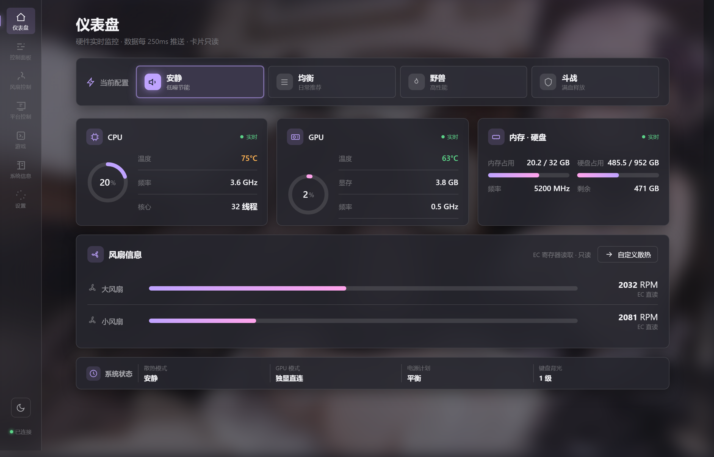
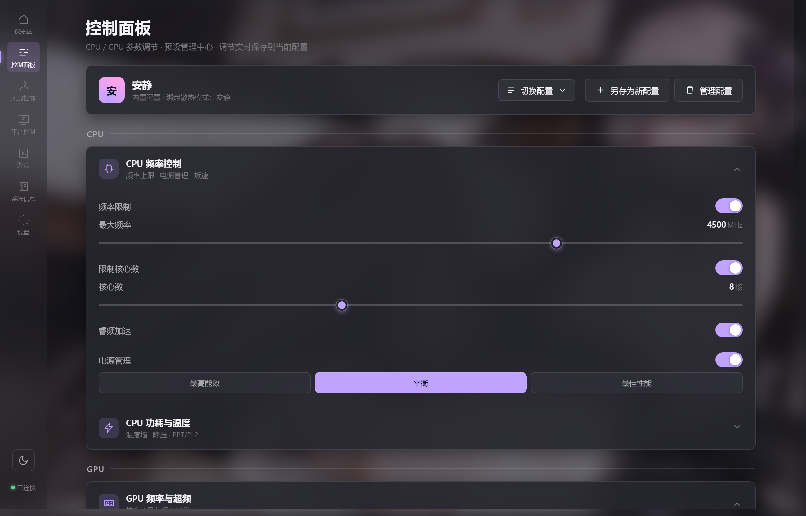
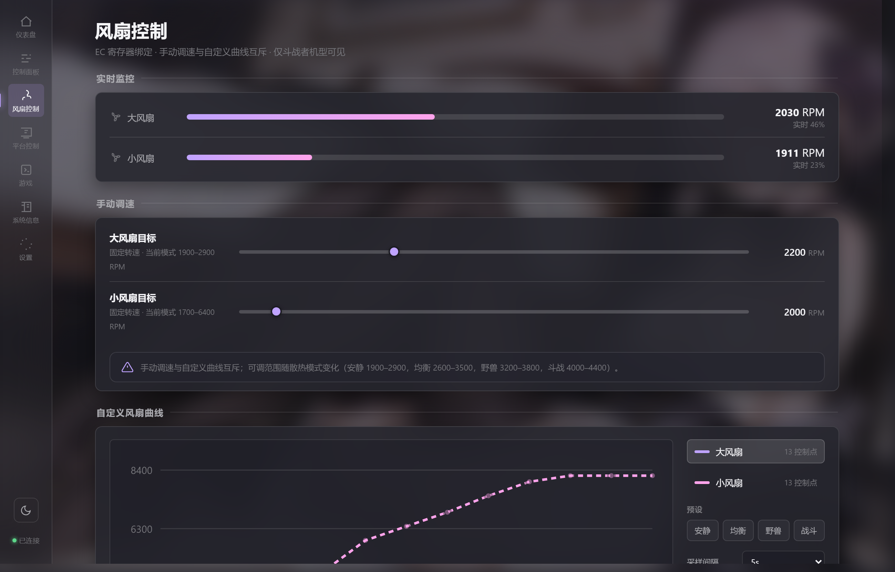
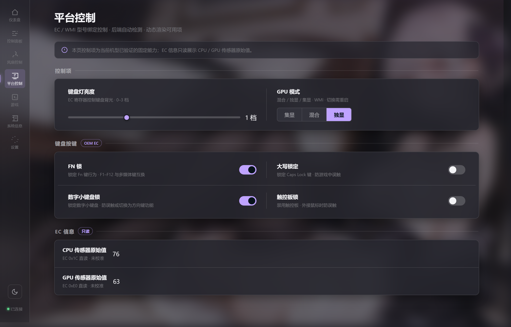
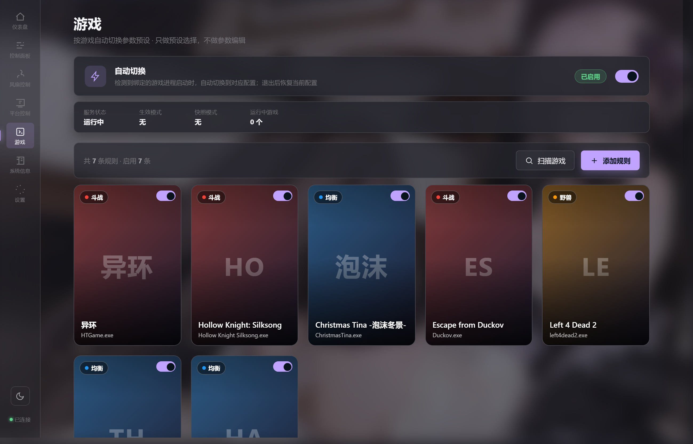
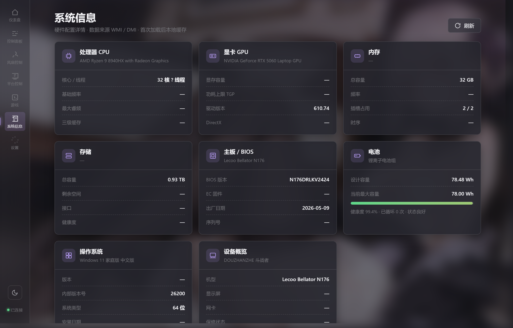
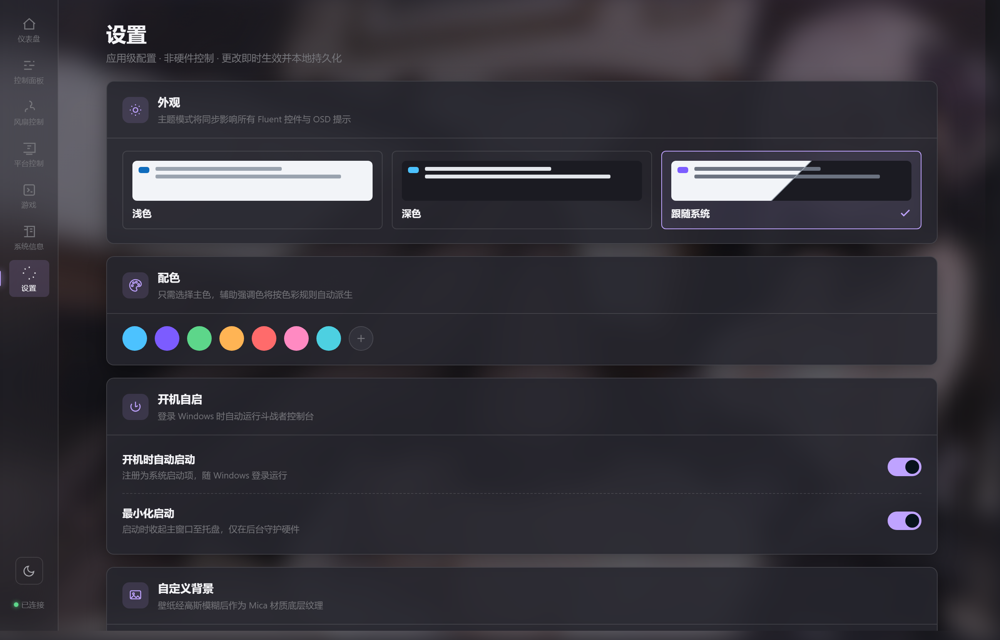

# Douzhanzhe Console

> [!WARNING]
> **风险提示 & 兼容性声明 / Disclaimer**
>
> **兼容性**：本控制台仅在 **联想斗战者战7000锐龙版 2025款** 上测试通过。
> **Intel 酷睿版（战7000P 2026）** 也受支持但仅有 PL1/PL2 控制（暂无温度墙/降压等）。
> 其他机型使用可能导致部分功能不可用。请在非兼容机型上谨慎使用。
>
> **操作风险**：本工具提供的部分功能涉及超出厂商预设范围的硬件参数调整（包括但不限于 CPU 功耗墙、温度墙、GPU 超频、EC 寄存器直写等）。
> **使用此类功能可能导致硬件损坏、系统不稳定、数据丢失，或影响厂商保修及售后服务。**
>
> 请在充分了解相关风险后自行决定是否使用。**因使用本工具造成的一切硬件损坏、系统故障、保修失效等后果，需由用户自行承担，本工具及其开发者不承担任何责任。**
>
> **Compatibility**: Tested on **Lenovo Legion 7000 Ryzen 2025 Edition**. Intel Core variant also supported with PL1/PL2 control only.
>
> **Use at your own risk.** The developers assume no liability for any hardware damage, system failure, or warranty issues.

> [!TIP]
> **下载安装 / Download**
> 获取最新安装包请访问：[GitHub Releases](https://github.com/KanzakiK/DOUZHANZHE-Control/releases/latest)

---

**斗战者控制台** — 专为联想斗战者系列打造的开源硬件控制面板。
替代官方联想电脑管家，提供完整的硬件监控、性能调优和系统控制能力。

**Douzhanzhe Console** — Open-source hardware control panel for Lenovo Legion 7000 series.
A full-featured alternative to Lenovo Vantage.

---

## 功能 Features（按标签页）

### 仪表盘 Dashboard

实时硬件监控与系统状态总览。

- 顶部“当前配置”卡片：安静 / 均衡 / 野兽 / 斗战 四档性能模式一键切换，切换状态由全局动画提示。
- CPU / GPU / 内存·硬盘 三块核心监控卡：温度、频率、占用率、功耗、显存、内存与磁盘占用，WebSocket 每秒推送全量遥测。
- 风扇信息卡：大/小风扇实时 RPM、转速百分比、EC 寄存器直读。
- 系统状态栏：当前散热模式、GPU 模式、电源计划、键盘背光等级聚合显示。
- 支持 @dnd-kit 拖拽排序与卡片隐藏/显示，打造个人专属仪表盘。



### 控制面板 Control

CPU / GPU 性能调优与配置管理。

- **CPU 频率控制**：频率上限、限制核心数、睿频加速、电源管理三档（最高能效 / 平衡 / 最佳性能）。
- **CPU 功耗与温度（AMD）**：功耗墙 PL1/PL2、温度墙、Curve Optimizer 降压，通过 PawnIO RyzenSMU.bin 直接写入。
- **Intel 机型**：PL1/PL2 功耗限制（PawnIO IntelMSR.bin）+ 频率/睿频/核心数限制（powercfg）。
- **GPU 频率与超频**：NVAPI P/Invoke + nvidia-smi 实现超频偏移、锁频、温度限制。
- 配置系统：切换配置、另存为新配置、管理配置，调节项实时保存到当前配置。



### 风扇控制 Fan

自定义风扇散热策略，仅斗战者机型可见。

- 实时监控：大/小风扇当前 RPM 与百分比。
- 手动调速：分别设置大/小风扇目标转速，范围随当前散热模式自动变化。
- 自定义温度-转速曲线：双风扇独立 13 控制点 SVG 曲线编辑器，支持预设按散热模式一键切换，后台 FanCurveService 定时写入 EC。
- 手动调速与自定义曲线互斥，避免策略冲突。



### 平台控制 Platform

机型专属的系统级控制项，仅斗战者机型可见。

- 键盘背光亮度：0–3 档滑块调节，EC 寄存器直写。
- GPU 模式：集显 / 混合 / 独显三档切换（WMI MiInterface），切换后持久化并提示重启。
- 键盘锁：Fn 锁、大写锁定、数字小键盘锁、触控板锁，防止游戏中误触。
- EC 信息：只读展示 CPU / GPU 传感器原始值（EC 0x1C / 0x0D 直读）。



### 游戏 Games

游戏进程感知与性能配置自动切换。

- 游戏海报墙：为每个已添加的游戏生成海报卡片，直观展示绑定配置。
- 自动切换：检测到绑定游戏进程启动时自动切换到对应配置，退出后恢复当前配置。
- 规则管理：扫描已安装游戏、手动添加规则、批量管理启用/禁用。
- 运行中游戏计数与生效状态实时展示。



### 系统信息 SysInfo

硬件配置卡片网格化展示。

- 处理器 CPU、显卡 GPU、内存、存储、主板 / BIOS、电池、操作系统、设备概览八大类信息。
- 关键字段直接可读：型号、核心/线程、显存、容量、BIOS 版本、电池健康度、操作系统版本等。
- 首次加载后本地缓存，右上角一键刷新。



### 设置 Settings

外观、启动、快捷键与备份。

- 外观：浅色 / 深色 / 跟随系统三档，同步影响所有 Fluent 控件与 OSD 提示。
- 配色：24 套主题皮肤，主色选择后辅助强调色按色彩规则自动派生。
- 开机自启：登录 Windows 时自动运行，支持最小化到托盘启动。
- 自定义背景：上传壁纸经高斯模糊后作为 Mica 材质底层纹理。
- 快捷键：自定义全局热键快速唤起面板或切换模式。
- 备份与导入：一键导出/导入全部配置；关于页面查看版本与更新。



## 安装 Installation

从 [Releases](https://github.com/KanzakiK/DOUZHANZHE-Control/releases) 页面下载最新安装包 `DouzhanzheConsole-*-Setup.exe`，双击运行即可。

安装程序会自动：安装 .NET 8 Runtime（如缺）、安装 PawnIO 内核驱动、清理旧版驱动残留。

> 安装包已签名，驱动安装需在 Windows 测试模式下或启用 TESTSIGNING。

## 快速开始（开发环境）

### 环境要求

| 工具 | 版本 | 验证命令 |
|------|------|----------|
| .NET SDK | 8.0 (net8.0-windows) | `dotnet --list-sdks` |
| Node.js | >= 18 | `node --version` |
| OS | Windows 10/11 x64 | — |
| 权限 | **管理员身份** | PawnIO + WMI 需要 |

### 启动（管理员 PowerShell）

```powershell
cd server/api
dotnet run --urls http://0.0.0.0:3100
```

访问 `http://127.0.0.1:3100`，Debug 面板在 `http://127.0.0.1:3100/debug`。

### 构建部署

```powershell
.\deploy.ps1          # 构建前端 + 同步到后端 wwwroot
```

## 技术栈

| 层级 | 技术 |
|------|------|
| 桌面壳 | WinForms + WebView2（单实例、托盘、开机自启） |
| 前端 | React 19 + Vite 8 + TailwindCSS 3 + @dnd-kit |
| 后端 | .NET 8 Minimal API + WMI + PawnIO |
| 内核驱动 | **PawnIO** v2.2.0.0（替代 inpoutx64 + WinRing0） |
| AMD SMU | PawnIO RyzenSMU.bin（替代 ryzenadj 子进程） |
| Intel MSR | PawnIO IntelMSR.bin |
| GPU 控制 | NVAPI P/Invoke（替代 KaronOC.dll）+ nvidia-smi |
| EC 直写 | PawnIO LpcACPIEC.bin |
| 安装包 | Inno Setup 6 |

## 项目结构

```
DOUZHANZHE-Control/
├── src/                        # React 前端
│   ├── App.jsx                 # 7 标签页 + 主题 Dock + 自定义背景
│   ├── components/
│   │   ├── SortableDashboard   # 拖拽仪表盘（11 张卡片内联渲染）
│   │   ├── panels/             # 8 个面板（含 IntelCpuPanel/IntelPowerPanel）
│   │   └── ui/                 # 10 个通用组件
│   ├── hooks/                  # useCardOrder, useControlState
│   └── services/               # uxtuAdapter (API 封装 + flattenBackendOverrides)
├── server/
│   ├── api/                    # .NET 8 后端
│   │   ├── Program.cs          # ~70 个端点 + WebSocket 遥测
│   │   ├── WmiInterface.cs     # WMI ACPI 硬件通信
│   │   └── TelemetryBackgroundService.cs
│   ├── hal/                    # 硬件抽象层
│   │   ├── DriverBridge.cs     # PawnIO EC IO（替代 inpoutx64）
│   │   ├── HardwareAbstractionLayer.cs
│   │   ├── AmdSmuController.cs # PawnIO RyzenSMU.bin（替代 ryzenadj）
│   │   └── IntelPowerController.cs  # PawnIO IntelMSR.bin
│   ├── services/               # FanCurveService, GameProfileService, OsdService...
│   └── shell/                  # WinForms 桌面壳
├── installer/                  # Inno Setup + 构建脚本
├── docs/                       # 开发文档
│   ├── dev-api.md, dev-backend.md, dev-frontend.md, ...
│   └── archive/                # 已归档的历史文档
├── screenshots/                # README 功能截图
└── vite.config.js              # Vite 配置
```

## 参考项目

- [PawnIO](https://github.com/namazso/PawnIO.Setup) — 内核驱动（EC IO / SMU / MSR）
- [BellatorFanControl](https://github.com/Aveare/BellatorFanControl) — 风扇控制参考
- [UXTU](https://github.com/JamesCJ60/Universal-x86-Tuning-Utility) — 通用调优工具
- [RyzenAdj](https://github.com/FlyGoat/RyzenAdj) — AMD SMU 参考协议
- [NvAPIWrapper](https://github.com/Orhl/NvAPIWrapper) — NVAPI .NET 封装参考

## 许可证

[GNU General Public License v3.0](LICENSE)
